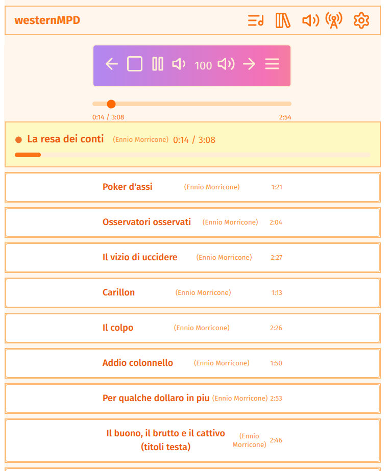
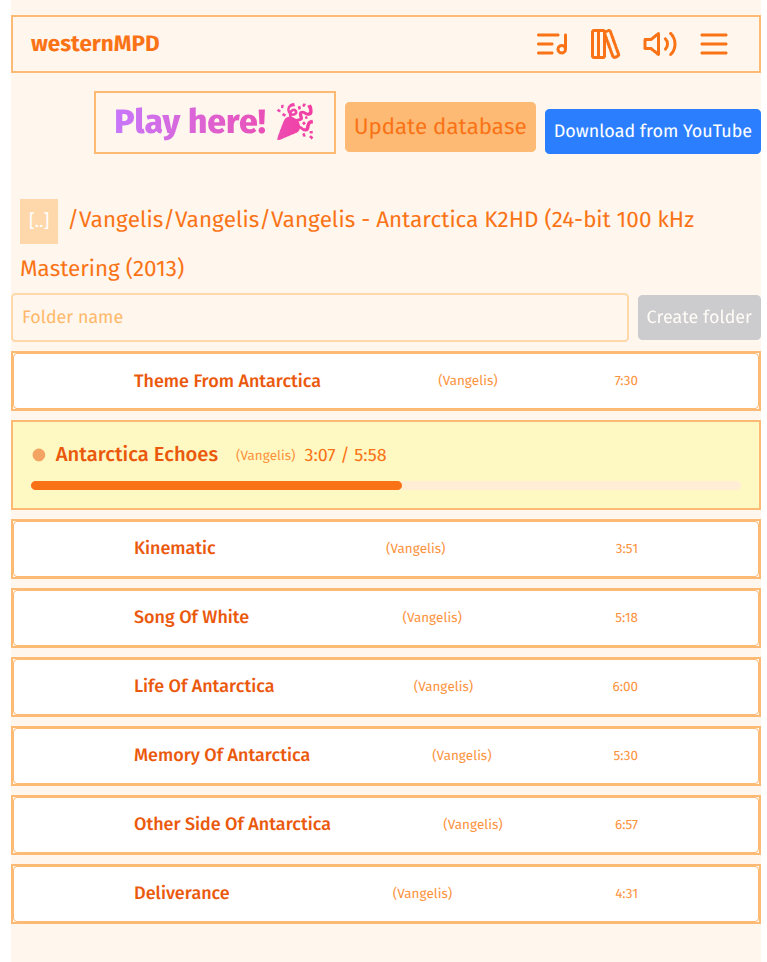
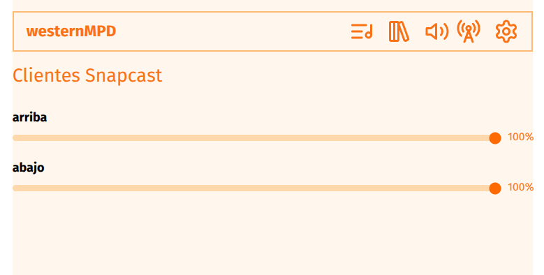
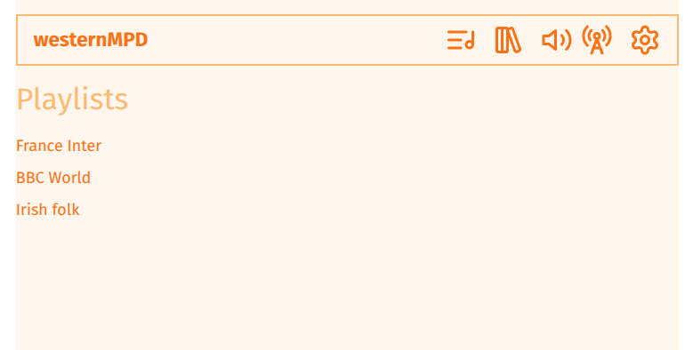
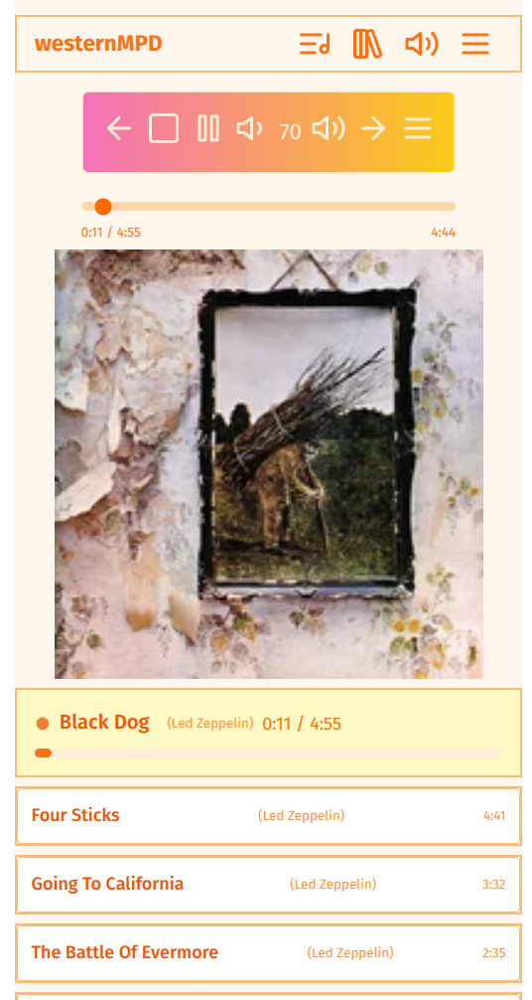
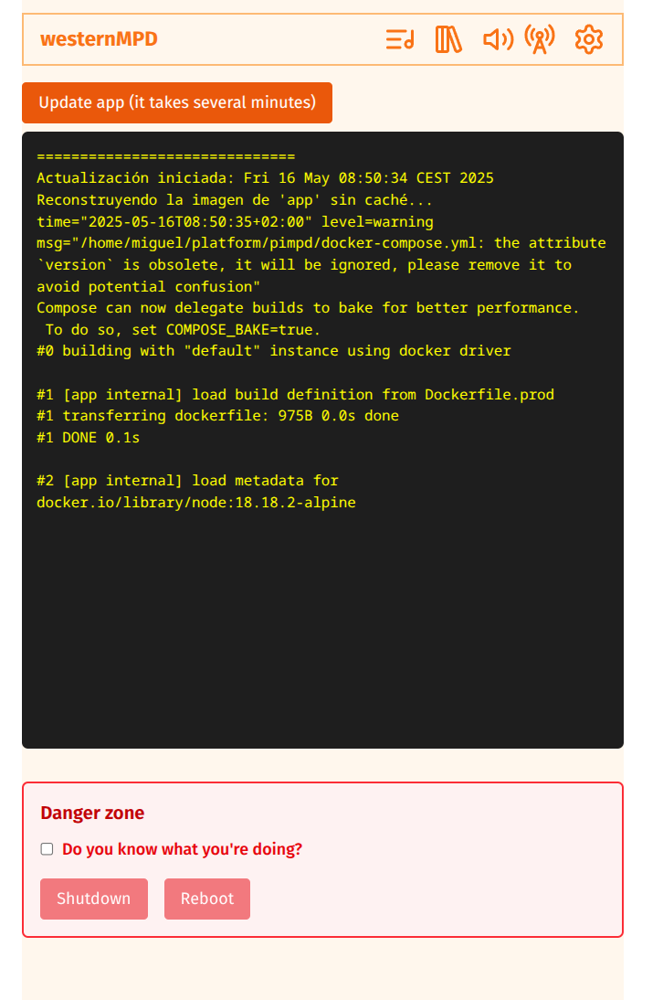

# westernMPD

**Webapp to manage [MPD (Music Player Daemon)](https://www.musicpd.org/)**  
Built with the [Qwik](https://qwik.dev/) framework and powered by [Perplexity AI](https://www.perplexity.ai/).

There is a companion [repository](https://github.com/yellowmachine/pimpd) to deploy a complete platform with Docker Compose on a Raspberry Pi.

This project also integrates with *snapserver* and *snapclient*, making it suitable for multiroom audio scenarios.

## Standalone Usage

If you want to use westernMPD as a standalone app, you need to set the following environment variables:

- **MPD_SERVER**: URL or hostname of your MPD server (default: `mpd`)
- **SNAPSERVER_URL**: URL or hostname of your Snapserver instance (default: `snapserver`)
- **API_KEY_LASTFM**: To display album covers, you need an API key from [Last.fm](https://www.last.fm/es/home).

## Screenshots

### Main Player View

### Library

### Snapclients

### Live radio

### Mobile view

### Manage system

